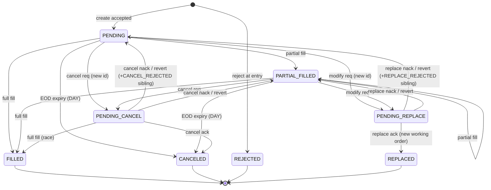

# tossinvest-rust — Data Model, Order FSM, and Wrapper Design

Analysis of the **Toss Securities Open API** (토스증권 Open API, OpenAPI `3.1.0`, spec version `1.0.3`)
and a recommended architecture for a Rust client crate.

Authoritative sources (vendored under `.docs/`):
- `.docs/openapi.json` — the OpenAPI spec (53 schemas, 20 operations)
- `.docs/overview.md` — categories, rate-limit groups, full error-code table
- `.docs/api-reference.md` — endpoint + model index
- Origin: `https://developers.tossinvest.com/llms.txt` → `https://openapi.tossinvest.com/openapi-docs/...`

---

## 0. Orientation

| | |
|---|---|
| **Protocol** | Pure **REST** (no WebSocket/gRPC). Base: `https://openapi.tossinvest.com` |
| **Auth** | OAuth 2.0 **client_credentials** grant → `Authorization: Bearer {token}` |
| **Account scope** | Account/asset/order endpoints additionally require header `X-Tossinvest-Account: {accountSeq}` |
| **Markets** | KR (KRX/NXT) + US (NYSE/NASDAQ/…) equities |
| **Money on the wire** | **Decimals are JSON strings** (`format: decimal`, `maxLength: 30`) — never floats |
| **Enums** | Spec mandates: *"clients MUST tolerate unknown enum values/codes"* → open enums |
| **Envelopes** | Success: `{ "result": T }`; Error: `{ "error": { requestId, code, message, data? } }` (mutually exclusive) |

### Endpoint map (20 operations, 9 tag-groups)

| Group | Endpoints | Account header | Rate-limit group (TPS) |
|---|---|:---:|---|
| Auth | `POST /oauth2/token` | — | `AUTH` (5) |
| Market Data | `GET /orderbook` `/prices` `/trades` `/price-limits` `/candles` | — | `MARKET_DATA` (10), `MARKET_DATA_CHART` (5 for candles) |
| Stock Info | `GET /stocks` `/stocks/{symbol}/warnings` | — | `STOCK` (5) |
| Market Info | `GET /exchange-rate` `/market-calendar/KR` `/market-calendar/US` | — | `MARKET_INFO` (3) |
| Account | `GET /accounts` | — | `ACCOUNT` (1) |
| Asset | `GET /holdings` | ✔ | `ASSET` (5) |
| Order | `POST /orders` `/orders/{id}/modify` `/orders/{id}/cancel` | ✔ | `ORDER` (6; **3 during 09:00–09:10 KST**) |
| Order History | `GET /orders` `/orders/{id}` | ✔ | `ORDER_HISTORY` (5) |
| Order Info | `GET /buying-power` `/sellable-quantity` `/commissions` | ✔ | `ORDER_INFO` (6; **3 during 09:00–09:10 KST**) |

Rate-limit headers on every response: `X-RateLimit-Limit/Remaining/Reset`, plus `Retry-After` on 429.

---

## 1. Data Model

53 schemas. The whole model is governed by four cross-cutting rules; learn these once and every schema follows:

1. **Decimals are strings** → parse to `rust_decimal::Decimal`, never `f64`. Rates are **ratios** (`0.1077` = 10.77%), not percentages.
2. **Open enums** → every enum gets an `Unknown(String)` tail that *preserves* the raw value.
3. **Envelope split by HTTP status** → `ApiResponse<T> { result }` on 2xx, `ErrorResponse { error }` on 4xx/5xx. Decode by status, don't try both.
4. **Nullable is rare and meaningful** → only specific fields are nullable; a `null` usually carries semantics (e.g. "US holding has no tax", "no overseas position"). Don't blanket-`Option`.

### 1.1 Shared scalars & enums
- `Currency` = `{KRW, USD}` (open) · `MarketCountry` = `{KR, US}` (open)
- `Side` = `{BUY, SELL}` · `OrderType` = `{LIMIT, MARKET}` (open) · `TimeInForce` = `{DAY, CLS, OPG}` (open; `OPG` response-only, unsupported for create)
- Strong newtype candidates: `Symbol` (pattern `^[A-Za-z0-9.\-]+$`; KR = 6-digit numeric, US = ticker), `AccountSeq(i64)`, `OrderId(String)` (opaque token), `ClientOrderId`, `Cursor`, `RequestId`, `IsinCode`.

### 1.2 Market Data
`OrderbookResponse{ timestamp?, currency, asks[], bids[] }` (asks asc, bids desc; `OrderbookEntry{ price, volume }`) ·
`PriceResponse{ symbol, timestamp?, lastPrice, currency }` ·
`Trade{ price, volume, timestamp, currency }` (timestamp **non-null** here) ·
`PriceLimitResponse{ timestamp, upperLimitPrice?, lowerLimitPrice?, currency }` (**limits null for US** — a KR/US discriminator) ·
`Candle{ timestamp(bar-open), open/high/low/close, volume, currency }` wrapped in `CandlePageResponse{ candles[], nextBefore? }` (cursor: feed `nextBefore` → `before`, descending in time; `null` ends).

### 1.3 Stock Info
`StockInfo{ symbol, name, englishName, isinCode, market(KOSPI/KOSDAQ/NYSE/NASDAQ/AMEX/…), securityType(STOCK/ETF/REIT/…), isCommonShare, status(SCHEDULED/ACTIVE/DELISTED), currency, listDate?, delistDate?, sharesOutstanding, koreanMarketDetail? }` ·
`KrMarketDetail{ liquidationTrading, nxtSupported, krxTradingSuspended, nxtTradingSuspended? }` (the `?` = N/A when NXT unsupported) ·
`StockWarning` (정리매매/과열/투자경고·위험/VI/신주인수권 flags).

### 1.4 Market Info (FX + calendars)
`ExchangeRateResponse{ baseCurrency, quoteCurrency, rate, midRate, basisPoint(signed), rateChangeType(UP/EQUAL/DOWN), validFrom, validUntil }` — reference rate, ~1-min refresh, **not** the execution rate.

Calendars return a **prev/today/next** triad of business days. The **KR vs US shapes differ structurally**:
- **KR**: `KrMarketDay{ date, integrated? }` where `IntegratedHour{ preMarket?, regularMarket?, afterMarket? }` nests three NXT/KRX sessions; each session carries a `singlePriceAuction{Start,End}Time` (Start on pre/regular, **End** on after — asymmetric, handle by exact name). `integrated == null` ⇒ full holiday.
- **US**: `UsMarketDay{ date, dayMarket?, preMarket?, regularMarket?, afterMarket? }` — **four flat sessions**, each a plain `{startTime, endTime}` (structurally identical → can share one `TimeWindow`). Full holiday ⇒ all four `null` (no collapse wrapper). **Times are expressed in KST**, so US regular/after sessions cross midnight into the next KST date; `date` is US-local.

### 1.5 Account & Asset
`Account{ accountNo, accountSeq(i64), accountType(BROKERAGE/…; only BROKERAGE today) }` — `accountSeq` is the `X-Tossinvest-Account` value; discover it via `GET /accounts`.

`GET /holdings` → `HoldingsOverview{ totalPurchaseAmount: Price, marketValue, profitLoss, dailyProfitLoss, items[] }`. The **per-holding vs aggregate** distinction is the crux:
- **Per-holding** (`HoldingsItem`): every figure is in the holding's own single `currency` (bare decimals). `Cost.tax` is the only nullable field (null for US). `quantity` is decimal (fractional US shares).
- **Aggregate** (`Overview*`): amounts are **currency-bucketed** via `Price{ krw, usd? }` — each bucket sums only same-currency holdings, **no FX mixing**. `krw` always present (`"0"` if empty); `usd` is `null` when no overseas holdings (asymmetry — preserve it). The **one** cross-currency blend is the aggregate `rate`/`rateAfterCost`, computed on the whole portfolio converted to KRW. So `sum(items) ≠ overview rate` — don't recompute it from buckets.

`GET /buying-power`, `/sellable-quantity`, `/commissions` round out the order-support figures (`Commission` rates are `Percent`/ratio).

### 1.6 Order data shapes
Covered as data here; the **lifecycle** is §2.
- `OrderCreateRequest` is a **`oneOf`**: `OrderCreateQuantityBased` (KR+US; `quantity` integer, `price` for LIMIT) **|** `OrderCreateAmountBased` (US `MARKET` only; `orderAmount` in USD, regular-hours only). Shared: `clientOrderId?` (idempotency key, 10-min window, **never auto-generated**), `confirmHighValueOrder` (required `true` ≥ 1억원; ≥ 30억 hard-rejected on modify).
- `OrderModifyRequest{ orderType, quantity?, price?, confirmHighValueOrder }` — **KR requires `quantity`; US forbids it** (`400 us-modify-quantity-not-supported`).
- `Order{ orderId, symbol, side, orderType, timeInForce, status, price?, quantity, orderAmount?, currency, orderedAt, canceledAt?, execution }` where `OrderExecution{ filledQuantity, averageFilledPrice?, filledAmount?, commission?, tax?, filledAt?, settlementDate? }`.
- Create returns `OrderResponse{ orderId, clientOrderId? }`. **Modify/cancel return `OrderOperationResponse{ orderId }` — a NEW id ≠ the original.**
- `GET /orders` → `PaginatedOrderResponse{ orders[], nextCursor, hasNext }`.

---

## 2. Order FSM (the centerpiece)

> **Two distinct concepts — do not conflate:**
> 1. **`orders[].status`** — the per-record `OrderStatus` (10 values). This is the *real* state machine.
> 2. **`GET /orders?status=`** — a coarse **lifecycle-group label** (`OPEN` | `CLOSED`) with a *different value system*. It is a **derived predicate** over `OrderStatus`, not a state.

### 2.1 States (`OrderStatus`)

| State | Meaning | Terminal | Group | Carries partial fills? |
|---|---|:---:|:---:|:---:|
| `PENDING` | Accepted, awaiting execution | no | OPEN | → moves to PARTIAL_FILLED |
| `PARTIAL_FILLED` | Some qty filled, rest working | no | OPEN | yes (`0 < filled < qty`) |
| `PENDING_CANCEL` | Cancel accepted, awaiting broker | no | OPEN | possible |
| `PENDING_REPLACE` | Modify accepted, awaiting broker | no | OPEN | possible |
| `FILLED` | Fully filled (`filled == qty`) | **yes** | CLOSED | full |
| `CANCELED` | Cancel complete | **yes** | CLOSED | possible (check `execution`) |
| `REJECTED` | Rejected by broker | **yes** | CLOSED | possible |
| `REPLACED` | Modify accepted; original superseded | **yes** (for original) | CLOSED | possible |
| `CANCEL_REJECTED` | Cancel rejected → **separate sibling record**; original **reverts** | **yes** (marker) | CLOSED | n/a |
| `REPLACE_REJECTED` | Modify rejected → **separate sibling record**; original **reverts** | **yes** (marker) | CLOSED | n/a |

**OPEN group** = `{PENDING, PARTIAL_FILLED, PENDING_CANCEL, PENDING_REPLACE}`. **CLOSED** = everything else, but `GET /orders?status=CLOSED` currently returns `400 closed-not-supported` (closed orders are still fetchable individually via `GET /orders/{id}`).

Three subtle, load-bearing rules:
- **Partial fills are orthogonal to status.** `CANCELED`/`REJECTED`/`REPLACED` may carry fills — read `execution.filledQuantity`, don't infer from the status.
- **Rejects of cancel/modify don't mutate the original.** They spawn a *sibling* `*_REJECTED` record; the original **reverts** to its prior `PENDING`/`PARTIAL_FILLED` state.
- **Modify/cancel mint a new `orderId`.** Keep polling the *original* id to watch the outcome; the returned id correlates the operation.

### 2.2 Transition table

`prev` = the state held immediately before `PENDING_CANCEL`/`PENDING_REPLACE` (`PENDING` or `PARTIAL_FILLED`).

| From | Event | To | Notes |
|---|---|---|---|
| ∅ | create accepted | `PENDING` | server `orderId` in `OrderResponse` |
| ∅ | broker reject at entry | `REJECTED` | `filled == 0` |
| `PENDING` | partial fill | `PARTIAL_FILLED` | |
| `PENDING` | full fill | `FILLED` | |
| `PARTIAL_FILLED` | partial fill | `PARTIAL_FILLED` | self-loop, `filled` grows |
| `PARTIAL_FILLED` | full fill | `FILLED` | |
| `PENDING`/`PARTIAL_FILLED` | cancel request | `PENDING_CANCEL` | new `orderId` minted |
| `PENDING`/`PARTIAL_FILLED` | modify request | `PENDING_REPLACE` | new `orderId` minted |
| `PENDING_CANCEL` | cancel ack | `CANCELED` | `canceledAt` set; fills retained |
| `PENDING_CANCEL` | cancel **nack** | `prev` | original **reverts**; `+CANCEL_REJECTED` sibling |
| `PENDING_CANCEL` | full fill (race) | `FILLED` | fill beats the cancel |
| `PENDING_REPLACE` | replace ack | `REPLACED` | replacement works under the new id |
| `PENDING_REPLACE` | replace **nack** | `prev` | original **reverts**; `+REPLACE_REJECTED` sibling |
| `PENDING`/`PARTIAL_FILLED` | EOD expiry (DAY) | `CANCELED` | unfilled remainder auto-canceled |
| `PENDING`/`PARTIAL_FILLED` | close auction (CLS/LOC, US) | `FILLED` | |

### 2.3 Diagram



### 2.4 Guard error-codes → illegal/guarded transitions

The `409`/`422` codes on cancel/modify encode the guards (model them as a typed, retry-aware error classification):

| Code | HTTP | Guards state | Class |
|---|---|---|---|
| `already-filled` | 409 | `FILLED` | permanent |
| `already-canceled` | 409 | `CANCELED` | permanent |
| `already-modified` | 409 | `REPLACED` (operate on the replacement) | permanent |
| `already-rejected` | 409 | `REJECTED` / sibling records | permanent |
| `already-processing` | 409 | `PENDING_CANCEL`/`PENDING_REPLACE` in flight | **transient** (honor `data.retryAfterSeconds`) |
| `cancel-restricted` / `modify-restricted` | 422 | reachable `PENDING`/`PARTIAL_FILLED` blocked by rules | permanent-ish |
| `order-hours-closed` | 422 | any, outside acceptance hours | **time-window** (`data.retryAfterAt`) |
| `opposite-pending-order-exists` | 422 | **creation** guard (opposite-side open order same symbol) | account invariant |

---

## 3. Recommended Rust wrapper design

**Verdict from a 3-way design bake-off (faithful-thin / type-safe / production-runtime):** take the **production workspace + middleware spine** as the skeleton, the **type-safe model crate** as the flesh (minus over-engineering), and enforce the **"one schema/op = one type/method, server is source of truth"** discipline so the model crate stays a mechanical mirror of the spec.

### 3.1 Workspace layout (3 crates, one-directional deps)

```
tossinvest-model   # LAYER 0 — pure data. no async/http. serde + rust_decimal + chrono + thiserror + secrecy
   ▲               #   scalars (Dec/IntQty/Ratio/Percent), open_enum! macro, newtypes, envelopes,
   │               #   all 5 domains, OrderCreateRequest oneOf, OrderStatus + predicates, full ErrorCode table
tossinvest-rate    # LAYER 0.5 — RateLimitGroup TPS table + 09:00–09:10 KST peak schedule (governor, chrono-tz)
   ▲
tossinvest         # LAYERS 1–3 — batteries-included client
                   #   transport/  L1: Transport trait + middleware stack (mockable)
                   #               Observe → Retry → RateLimit → Auth → Account → Reqwest
                   #   api/        L2: one fn per operationId; call<T>() = status-split deserialize
                   #   client.rs   L3: TossClient + AccountClient<'_> handle (account scoping)
                   #   paginate.rs lifecycle.rs clock.rs error.rs
```

**Dependency stack:** `reqwest`(rustls) · `tokio`(sync,time only in lib) · `serde`/`serde_with`/`serde_json` · `serde_urlencoded` (the lone OAuth form body) · `rust_decimal` · `chrono`+`chrono-tz` · `governor` (per-group GCRA) · `backon` (backoff+jitter) · `thiserror` · `secrecy` (wrap `client_secret`/token) · `tracing` · `async-trait`. Dev: `wiremock`, `trybuild`. Vendor `openapi-1.0.3.json` as a regen input + golden-test fixture.

### 3.2 The decisions that matter

**Order lifecycle = plain open enum + derived predicate, NOT typestate.** The client only *observes* the FSM by polling; it never drives the broker, and the spec mandates tolerating unknown statuses (which a closed typestate cannot represent). The transition table lives as *data for observability* ("did the server hand me a transition I didn't expect? → `tracing::warn!`"), never to gate calls — the server's `already-*` guards are the real enforcement.

```rust
open_enum!(OrderStatus { Pending=>"PENDING", PendingCancel=>"PENDING_CANCEL", /* … */ });
impl OrderStatus {
    pub fn is_open(&self) -> bool { matches!(self, Self::Pending|Self::PartialFilled|Self::PendingCancel|Self::PendingReplace) }
    pub fn is_terminal(&self) -> bool { /* Filled|Canceled|Rejected|Replaced|*Rejected */ }
    pub fn group(&self) -> Option<LifecycleGroup> { /* None for Unknown — don't guess */ }
}
pub enum OrderListFilter { Open, Closed }   // distinct type from OrderStatus — different value space
```

**Open enums preserve the unknown string** (a macro, not `#[serde(other)]` which drops it). Applies to `OrderStatus`, `OrderType`, `TimeInForce`, `Currency`, `MarketCountry`, `AccountType`, `RateChangeType`, `ErrorCode`.

**Decimals are `Dec(Decimal)` with string serde; never `f64`.** Distinct `Ratio` vs `Percent` newtypes prevent off-by-100 bugs. `IntQty` validates `^\d+$` on construction.

**`OrderCreateRequest` = untagged 2-variant enum + smart constructors** (`limit`/`market`/`market_amount`) so price-on-market / limit-without-price are unrepresentable on the happy path.

**Account header is unforgettable:** account-scoped endpoints exist *only* on `client.account(seq) -> AccountClient<'_>`, and an `AccountLayer` injects `X-Tossinvest-Account` centrally → `400 account-header-required` is structurally unreachable.

**Errors:** full open `ErrorCode` enum **+** a small `ApiErrorKind` control-flow classification (`RateLimited`, `OperationInProgress`, `AlreadyTerminal`, `OrderHoursClosed`, `Restricted`, …) driving `is_retryable()`. Always carry raw `code` + `request_id` + `data` so unknown future codes degrade gracefully.

**OAuth token manager:** proactive refresh (60s skew) + **single-flight** (one `/oauth2/token` under burst) + reactive-401 invalidate. Lives in a middleware layer that bypasses itself when fetching the token (no recursion) and is itself `AUTH`-group rate-limited.

**Rate-limit + retry:** one `governor` bucket per group, seeded from the TPS table, acquired *before* the request (proactive shaping). Order of middleware: `Observe(outermost) → Retry → RateLimit → Auth → Account → Reqwest`. **Safety rule:** a `POST /orders` *without* `clientOrderId` is non-idempotent → **never auto-retried** (a blind retry could double-order).

**Pagination:** candle (`nextBefore`→`before`) and order (`nextCursor`/`hasNext`) cursors exposed both as single-page methods (1:1 discipline) and as `futures::Stream` adapters. `Cursor` newtype is distinct from `OrderId`.

**Lifecycle observer (`OrderTracker`):** polls the **original** id; on a `*_REJECTED` sibling it knows the original reverted and resumes tracking it; on `REPLACED` it links original → replacement. No in-place mutation of orders.

### 3.3 Roadmap

| Phase | Milestone | Done-when |
|---|---|---|
| 0 | Workspace + scalars (`open_enum!`, `Dec`/`IntQty`/`Ratio`/`Percent`, newtypes, envelopes) | golden round-trip of every spec example for scalars/envelope |
| 1 | `tossinvest-model` complete (all 5 domains, `ErrorCode`, order oneOf + `OrderStatus`) | compiles `--no-default-features`; golden tests cover empty-holdings / null-usd / partial-fill-on-canceled / holiday-calendar nulls |
| 2 | Transport spine (`Transport` trait, `Reqwest`/`Mock`, injectable `Clock`) | `prices()` works against `wiremock` |
| 3 | Auth + envelope decode (`TokenManager`, `call<T>()` status-split) | concurrent burst → exactly one token fetch |
| 4 | Rate-limit + retry + observe | virtual-clock test: 3×429-then-200 backs off correctly; non-idempotent create not retried |
| 5 | Full API surface + `AccountClient` scoping | every endpoint typed; account header unforgettable |
| 6 | Pagination streams + `OrderTracker` reconciliation | nack-revert / sibling-reject / replaced-relink tests pass, no network |
| 7 | Polish (`blocking` feature, otel/mock features, rustdoc, examples, cargo-deny, MSRV CI) | CI matrix green |

### 3.4 Open questions / risks
1. **Verify the exact TPS table + peak-window scope** from `overview.md` before shipping the limiter; make it config-overridable.
2. `GET /orders?status=CLOSED` 400s today — keep `OrderListFilter::Closed` expressible but surface the typed error (forward-support is one line).
3. `ErrorData` typed as all-`Option` keys + `#[serde(flatten)] extra` — golden-test real `data` payloads per code.
4. Confirm `OPG` is truly create-rejected (response-only) so the create restriction is faithful.
5. `rust_decimal` is ~28–29 sig digits vs spec `maxLength:30` *chars* — add a maximal-length golden test to prove no truncation.
6. `async fn` in `Transport` via `async-trait` (object-safe `dyn` middleware chain) — revisit if `dyn`-RPITIT lands.

---

## 4. Stateful / Observable Layer (UI-friendly) — `tossinvest-state`

**Goal:** the UI should *not* poll. The wrapper holds live state and the UI **subscribes** to changes. This is a **new L4 crate, strictly additive** — every one-shot stateless method (§3) stays unchanged and is in fact the layer's own substrate.

**The reality to design around:** the API is **REST-only, no push.** So "stop polling" means *centralize* polling inside the wrapper: **one** background reconciler task does all of it (rate-limit-aware via the shared `governor`), and N UI subscribers share that one loop — nobody polls per-widget.

### 4.1 The cheap engine: the `OPEN` sweep + drop-detection

- `GET /orders?status=OPEN` returns **all** working orders in **one unpaginated page** → one periodic call reveals every transition at once.
- `status=CLOSED` is `400` (unsupported) → when an order **drops out** of the sweep set, do **one** `get_order(id)` to capture its terminal status, then stop tracking it. Drop-from-sweep (set difference) is the *only* trigger for a terminal fetch.
- Terminal is a **monotone latch**: `apply` ignores late/duplicate terminal snapshots, so sweep-drop vs op-fetch vs sync-error races are order-independent no-ops.

### 4.2 Architecture verdict (from a 3-way bake-off)

**Event-sourced single-writer core (C), in a runtime-agnostic crate (B `core ⊥ rt/` split), exposing both an `arc-swap` snapshot and a delta stream (A's two-channel ergonomics).**

```
tossinvest-state   L4   NEW
 ├─ core/          runtime-AGNOSTIC, NO tokio in any public type, pure & replay-testable
 │   ├─ event.rs       DomainEvent + Sequenced<E>     (the source of truth — a log of facts)
 │   ├─ project.rs     ProjectedState::apply          (PURE fold — the tested heart)
 │   ├─ view.rs        OrderView / Lifecycle          (UI-facing projection)
 │   ├─ reconcile.rs   Order/Price/Holdings → Vec<DomainEvent>   (FSM rules, pure)
 │   ├─ schedule.rs    Cadence tiers + deadline math (Clock-driven, pure)
 │   ├─ demand.rs      ref-counted leases (RAII)
 │   ├─ store.rs       ArcSwap<ProjectedState> + Subscriber registry + delta fan-out
 │   └─ driver.rs      StateDriver: sync poll(now)->Due / ingest(WorkResult)  step-function
 └─ rt/
     ├─ tokio.rs   [feature="tokio", default]   spawns the pump; watch/broadcast bridges; StateHandle
     └─ blocking.rs[feature="blocking"]          std-thread pump for non-tokio hosts
```

Two additive asks of lower crates (both already implied): `tossinvest-rate` exposes a process-wide `RateLimiterRegistry` (so the reconciler's sweep and a direct UI `create_order` share the **same** `ORDER_HISTORY=5`/`ORDER=6`/`MARKET_DATA=10` buckets — the store can never push the process over TPS); `tossinvest` adds `account_owned(seq) -> AccountClient<'static>` (the actor must outlive any single call).

### 4.3 Data flow (one writer, publish-before-notify)

```
 UI handles ──commands(flume)──►┌ ONE background pump (rt/tokio.rs) ───────────────────┐
 (StateHandle, clone=Arc bump)  │  Due{work,deadline} = driver.poll(now)   ◄── core, PURE │
   ├ Submit (optimistic)        │  results = perform(work) via UNCHANGED AccountClient ───┼─► stateless api/ + shared governor
   ├ Lease (ref-counted)        │  for r in results { driver.ingest(r) }                  │
   └ Seed (one-shot result)     │     └► reconcile → store.emit(event):                   │
                                │           1. seq+=1   2. apply(fold)                    │
                                │           3. ArcSwap.store(snapshot)  ── publish FIRST ──┼─► (a) snapshot(): Arc<ProjectedState>  (egui)
                                │           4. registry.notify(delta)   ── THEN notify ────┼─► (b) events()/watch() bridges          (Tauri/SSE/TUI)
                                │  select!{ biased; cancel | command | sleep_until(dl) }   │
 last StateHandle drop ─────────┴► CancellationToken.cancel → emit(Stopped) → task joins ─┘  (no leaked task)
```

**Load-bearing invariant:** publish the snapshot **before** notifying subscribers, and `seq == snapshot.generation`, so a lagged delta consumer just re-pulls `snapshot()` and is exactly consistent — the snapshot is always authoritative; the stream is an optimization with a defined recovery.

### 4.4 Decisive verdict: expose **BOTH** read primitives

The three UI shapes have non-negotiably different needs:

| UI shape | Needs | Primitive |
|---|---|---|
| **egui / iced** (immediate-mode, 60 fps) | "what is the world *now*?", zero-await, per frame | **snapshot** (`arc-swap` `load_full()` — one atomic + Arc bump) |
| **Tauri / axum-SSE** (event-driven) | "what *changed*?" as discrete facts to emit to JS (toast on `CancelRejectedReverted`, animate `FillAdded{delta}`) | **delta stream** (snapshot = lag fallback) |
| **ratatui** (TUI) | one "something changed → redraw" wake in a `select!` | **delta stream as wake**, snapshot to render |

Deltas are **not** mere snapshot diffs — a snapshot going `filled: 3 → 5` can't recover whether that was one fill of 2 or two of 1; `FillAdded{delta,cumulative}` and `CancelRejectedReverted` are toast-worthy facts a diff destroys. So the **event log is the source of truth**; the snapshot is a continuously-maintained fold over it. The public contract: a runtime-free `subscribe(impl Subscriber)` trait (egui registers `|_| ctx.request_repaint()`; a TUI pushes to its own `mpsc`) **plus** `tokio`-feature `events() -> broadcast::Receiver` / `watch() -> watch::Receiver` bridges.

### 4.5 Core types (condensed)

```rust
// One logical order spans MANY server ids over its life — the store stitches them:
//   ClientOrderId (pre-confirm idempotency anchor) → OrderId root (canonical key, poll forever)
//   → OrderId op-id (modify/cancel mint a NEW id; also the *_REJECTED sibling / REPLACED replacement id)
pub enum OrderKey { Local(LocalId), Server(OrderId) }   // optimistic rows start Local, rekey on confirm

pub enum DomainEvent {                                   // every variant is a FACT, never a command
    OrderSubmitted{..}, OrderConfirmed{key, server_id, ..},   // Local→Server rekey
    OrderObserved{..}, OrderTransitioned{from, to, ..},
    FillAdded{delta, cumulative, ..},                    // orthogonal to status
    OrderFinalized{status, final_order, cause}, OrderEvicted{..},
    OpSubmitted{..}, OpAccepted{op_id, ..},
    CancelRejectedReverted{op_id, reverted_to}, ReplaceRejectedReverted{..},  // original REVERTS; sibling attached
    ReplacedLinked{original, replacement_id},            // promote replacement to its own root
    SubmitFailed{error}, HoldingsUpdated{..}, PriceTick{..}, OrderbookTick{..},
    LaneHealthChanged{..}, Stopped,
}

#[derive(Clone, Default)]
pub struct ProjectedState {                              // the snapshot the UI reads
    pub orders: HashMap<OrderKey, OrderView>, pub holdings: Option<HoldingsOverview>,
    pub prices: HashMap<Symbol, PriceResponse>, pub orderbooks: HashMap<Symbol, OrderbookResponse>,
    pub health: HashMap<Lane, LaneHealth>, pub generation: u64, pub stopped: bool,
    /* private server_index / op_index for O(1) id resolution */
}
impl ProjectedState { pub fn apply(&mut self, ev: &DomainEvent) { /* PURE, idempotent, terminal-latched */ } }

pub enum Lifecycle {                                     // the flat enum renderers match on
    SubmittingPending, Working, Closing{kind: OpKind}, Closed{reason: ClosedReason},
    UnknownStatus, SubmitRejected{retryable: bool, message: String},
}
pub struct OrderView {
    pub key: OrderKey, pub server_id: Option<OrderId>, pub symbol: Symbol, pub side: Side,
    pub status: OrderStatus, pub lifecycle: Lifecycle,
    pub quantity: IntQty, pub filled: Dec /* ALWAYS execution.filledQuantity */, pub price: Option<Dec>,
    pub pending_op: Option<PendingOp> /* spinner */, pub links: OrderLinks /* replaced_by/replaces/reject_siblings */,
}
```

```rust
// The public handle (account-scoped, cloneable = Arc bump)
impl StateHandle {
    pub fn spawn(client: AccountClient<'static>, cfg: SchedulerConfig) -> Self;  // one reconciler task
    fn snapshot(&self) -> Arc<ProjectedState>;                                   // (a) wait-free
    fn subscribe(&self, s: impl Subscriber) -> Subscription;                     // (b) runtime-free
    #[cfg(feature="tokio")] fn events(&self) -> broadcast::Receiver<Sequenced<DomainEvent>>;
    #[cfg(feature="tokio")] fn watch(&self)  -> watch::Receiver<Arc<ProjectedState>>;
    fn watch_orders(&self) -> OrdersLease;                                       // RAII demand leases
    fn watch_prices(&self, syms: &[Symbol]) -> PricesLease;  // N leases coalesce → ONE batched GET /prices
    fn create_order(&self, req: OrderCreateRequest) -> SubmitToken;             // optimistic: provisional row NOW
    fn modify_order(&self, id: &OrderId, req: OrderModifyRequest) -> SubmitToken;
    fn cancel_order(&self, id: &OrderId) -> SubmitToken;
    fn seed_orders(&self, orders: Vec<Order>);                                   // feed a one-shot result in, no extra network
    async fn shutdown(self);                                                     // Drop also cancels
}
```

### 4.6 Adaptive cadence (poll fast only when something's in flux)

| Tier | When | Interval |
|---|---|---|
| `Hot` | an op is in-flight (`PENDING_CANCEL`/`PENDING_REPLACE`/unconfirmed submit) **or** a `PARTIAL_FILLED` exists | floor ~300–500 ms (capped by TPS) |
| `Working` | ≥1 OPEN order, none mid-op | base ~1–2 s |
| `Idle` | no tracked orders but subscribers exist | order lane near-suspended; market lane runs its own cadence |
| `Stopped` | no demand at all | parked (zero network/CPU) |

AIMD-flavoured: decay toward `ceil` on quiet sweeps, snap to `floor` on activity; jitter every deadline to decorrelate processes. Urgent per-id fetches (terminal capture, op-id resolution — latency-sensitive) drain before the periodic sweep within the shared `ORDER_HISTORY` budget. Market data is **demand-driven**: prices for symbol X are polled only while someone holds a lease on X, and a symbol that's also a `Hot` order's symbol coalesces to the faster cadence.

### 4.7 Edge cases the reconciler handles (representative)

| Sequence | Store action | UI sees |
|---|---|---|
| **cancel-rejected revert** | op-id resolves `CANCEL_REJECTED`; attach as sibling; **root never finalized**; clear cancel | `Working` → +spinner → `Working` ("cancel rejected") |
| **modify-accepted replacement** | finalize root `Closed{Replaced}`; promote replacement id to new root with `replaces=root` | root closes; new linked order appears |
| **fill wins race** (`PENDING_CANCEL` → `FILLED`) | finalize `Closed{Filled}`; op marked `RaceLostToFill`; later `already-filled` absorbed by latch | +spinner → `Closed{Filled}` (no "canceled" flicker) |
| **stale/duplicate sweep** | drop gated on prior-committed presence + `last_seen_open`; monotone guards make re-apply a no-op | no spurious `Closed` |
| **cancel on already-filled** (sync `409`) | classify `AlreadyTerminal` → drop optimistic, force `get_order(root)` | spinner → `Closed{Filled}`, no error |
| **app restart** | first OPEN sweep → all working orders as fresh `Working` roots; in-flight ops not reconstructed (server is truth); old terminals absent (CLOSED unfetchable in bulk) | full working set in one tick |
| **unknown status** | `group()==None` → `UnknownStatus{raw}`, kept polled, `warn!` | shown verbatim, poller never wedges |

### 4.8 Coexistence with one-shot methods

1. The reconciler **is** a stateless-API client — every `WorkItem` is a 1:1 unchanged `api::` call through the existing spine. A CLI depends on `tossinvest` alone and never knows L4 exists.
2. **Shared governor budget** — reconciler sweep + any direct UI `create_order` draw from the same `RateLimiterRegistry`; the store has no privileged network path. An order created outside the layer is picked up by the next sweep automatically.
3. **Seeds** — a startup `get_orders(Open)` or a deep-link `get_order(id)` is fed via `seed_orders`/`seed_holdings` through the *same* `reconcile.rs` funnel, producing identical events; a stale seed can never regress a latched terminal or lose a fill. *A seed is just more events.*

### 4.9 Roadmap delta (append to §3.3)

| Phase | Milestone | Done-when |
|---|---|---|
| **8** | Event + projection core (`core/` only, `--no-default-features`) | full reconciliation-quirk suite passes as **pure `apply`-replay** (zero network/clock); `record` feature round-trips a captured log |
| **9** | `StateDriver` + scheduler (cadence tiers, sweep-drop→terminal-fetch, op-id resolution, ref-counted leases, batched prices) | `TestClock` drives a full lifecycle deterministically; `poll`/`ingest` asserted in microseconds |
| **10** | tokio adapter (pump, `StateHandle::spawn`, `account_owned`, `RateLimiterRegistry` wired, watch/broadcast bridges, cancellation) | shared-budget test: sweep + direct create never exceed group TPS; last-handle-drop emits `Stopped` + joins (no leaked task) |
| **11** | UI adapters + `blocking` pump: egui / Tauri-SSE / ratatui examples; `serde` on view+delta types | three example binaries render live state; `blocking` pumps the same driver with zero tokio |

### 4.10 Risks specific to this layer
- **Polling cost vs freshness** → adaptive cadence + AIMD backoff + jitter; idle/stopped parks lanes.
- **Terminal-capture correctness** → OPEN sweep is the *sole* authority for "is open"; drop-from-sweep is the only terminal-fetch trigger; terminal is a monotone latch.
- **Rate-limit budget split** → reconciler shares the real `RateLimiterRegistry`; urgent fetches drain before periodic sweep; back off on `X-RateLimit-Remaining`, park on `Retry-After`.
- **Restart rehydration** → one OPEN sweep warm-starts the working set; in-flight ops not reconstructed (server is truth); optional `seed_orders` avoids waiting for the first sweep.
- **`emit`-time snapshot rebuild** (event-sourcing cost) → bounded by open-set size not subscriber count; `Arc`-shared sub-collections; switch the write-side fold to `im::HashMap` if profiling ever shows pressure (no public-API change).
- **Non-idempotent create double-order** → a create without `clientOrderId` is never auto-retried; a transient failure surfaces as `SubmitFailed{retryable}` for the user to decide.

---

## 5. Control Plane: on-demand refresh, tunable cadence, adaptive rate-limit, cross-resource invalidation

Four UI-driven concerns. The key realization: they are **not four features — they are one control system** writing to/reading from two objects that already exist in §4 (the single-writer **work queue** and the shared **`RateLimiterRegistry`**). No parallel subsystems; no privileged path around the governor.

### 5.1 On-demand refresh ("update now")

`handle.refresh(target).await` drops a `Command::RefreshNow` on the pump's channel, edge-wakes it, and injects an **urgent** work item. Honest contract: **"now" = "as soon as the governor admits the call"** — the returned future resolves when the data is **folded into the snapshot** (tied to the resulting `seq`), not when the HTTP returns, and `RefreshOutcome::admitted_after` surfaces any rate-limit wait.

```rust
pub enum RefreshTarget { All, Orders, Order(OrderId), Holdings, BuyingPower,
                         Sellable(Symbol), Prices(Vec<Symbol>), Orderbook(Symbol) }
pub struct RefreshOutcome { pub seq: u64, pub admitted_after: Duration, pub coalesced: bool, pub legs: SmallVec<[RefreshLeg;4]> }
```

- **Coalescing:** a `refresh(Orders)` while a sweep (periodic or another refresh) for the same target is in flight *attaches* to it — all callers' oneshots fire on the one result. No double-fetch.
- **Post-mutation auto-kick:** the instant a create/modify/cancel response lands, the reconciler urgently re-polls the affected order and resets its lane to `Hot`. This is the answer to *"latest right after the user acted"* — because for **user-initiated** events we know the exact moment to look.
- **Hard ceiling (no push):** for **autonomous server-side fills** there is nothing to kick on; `refresh()` can only pull the *next* poll forward to the next admission, not to "now." Freshness for market-initiated events is fundamentally bounded by `effective_tps` + the cadence floor.

### 5.2 UI-tunable cadence + the safeguard

Per-handle `SchedulerConfig` (lane base/floor/ceil) and per-lease `CadenceHint` (foreground chart vs background watchlist; fastest hint wins per lane, RAII-relaxed on drop). These **compose into** the §4.6 tiers, never bypass them.

**The safeguard:** no UI setting may exceed the limit, because a lane's effective floor is computed from its group's **dynamic** effective TPS (§5.3) and the in-flight item count:

```
min_interval(lane) = items_in_group / (effective_tps(group) − other_lane_demand − headroom)
applied_floor      = max(requested_floor, min_interval, HARD_MIN)     // HARD_MIN ~50ms
```

A `desired_floor=50ms` on `ORDER_HISTORY=5` with N items clamps to a feasible value; the **aggregate** demanded rate across all lanes in a group stays ≤ budget. `reconfigure()` returns the **as-applied** config, and `applied_cadence()` is a live `watch` stream so the UI can render *"updating every 200 ms (rate-limited)"*. Transparency over silent clamping.

### 5.3 Dynamic rate limiting (congestion control)

Documented TPS is the **ceiling, not gospel**. A per-group controller adapts to real server feedback:

| Signal | Authority | Action |
|---|---|---|
| `X-RateLimit-Limit/Remaining/Reset` | **authoritative** when present | set the bucket to match — the server is telling you the current capacity, don't guess |
| `Retry-After` (429) | authoritative | **park** the group until then |
| 429 w/o headers (the *undocumented throttle under load* case) | inferred | **AIMD** multiplicative decrease (×0.5–0.7) |
| timeout / 5xx / rising latency (EWMA) | soft | gentle decrease; seam for a future gradient controller |

**Control law:** per-group AIMD, **bounded to `[floor, documented_baseline]`** — it only ratchets *down* under observed throttling and recovers *up to* (never beyond) the published ceiling. Cooldown/hysteresis on decreases + jittered additive recovery avoid oscillation and thundering-herd. The scheduled 09:00–09:10 KST 6→3 window is the one piece shaped **proactively** (read from the `Clock`); everything else is observe-then-correct.

**Implementation:** a `DynamicLimiter` per group whose `governor` quota is swapped via `ArcSwap` (sub-1% no-op guard + cooldowns keep swaps seconds apart), fed by a `Feedback` channel the `Observe`/`Retry` layers publish into. It **composes** with the existing `RetryLayer` (retry = *this* request honoring `Retry-After`; controller = the steady-state pipe rate for *future* requests). `rate_status()` exposes per-group `nominal vs effective tps, parked_until, last_action` for the UI.

> **Why AIMD-on-observed-429 is the right tool (and its limit):** the server limits per `client_id × group`, so **N app instances under one `client_id` share one server bucket they can't see each other through.** AIMD self-balances the fleet around the true limit with zero coordination (TCP's insight), but it *converges*, it doesn't *prevent* — expect a small boundary overshoot + a few-second convergence lag per new instance. A hard fleet guarantee needs an external shared bucket / single egress proxy; the honest library recommendation is **one process owns the `client_id`**, AIMD covers the residual. Reactive-with-header-authority beats predictive here *because the API gives explicit `429 + Retry-After + X-RateLimit-*`* — guessing where you could read would be strictly worse.

### 5.4 Cross-resource invalidation ("one event stales another endpoint")

A fill stales holdings **and** buying-power **and** sellable-for-that-symbol. This is real broker-domain knowledge worth encapsulating — **as a `mark-dirty + coalesce + demand-gate + budget-drain` mechanism that produces *scheduling pressure, never data*:**

```rust
pub trait InvalidationRules { fn stale(&self, cause: &Cause) -> Vec<Resource>; }
// DefaultRules: Fill/Finalized{Filled} → {Holdings, BuyingPower, Sellable(sym)};
//   buy submit/confirm → {BuyingPower};  cancel-ack/Canceled → {BuyingPower, Sellable(sym)};  Replaced → {BuyingPower}
```

The four guards that make it an asset rather than a 429-generator:
- **Coalesce** — a 10-fill burst marks `Holdings` ten times into a `HashSet`, refetches **once**.
- **Demand-gate** — `dirty ∧ leased`: a staled resource nobody watches costs one set entry and **zero requests** until a lease appears (then redeems once).
- **Overridable** — `with_invalidation_rules(...)`; the table is a trait, not buried `match` arms.
- **Freshness, not consistency** — the API has **no cross-endpoint transaction**; the dirty bit is a *prediction* that prioritizes a refetch, and the refetch is the only truth. The layer never writes a derived number; empty rules → still converges, one sweep slower. Type names (`DirtySet`, `stale()`) must telegraph this.

The footgun, named: the naive `on fill: await holdings(); await buying_power(); await sellable()` turns 1 fact into 3 awaited calls, a 10-fill burst into 30 requests against buckets of 5/6/6, and during the peak window (`ORDER_INFO`→3 TPS) **guarantees** a self-inflicted 429 cascade. *Same intuition, wired to the network instead of the coalescing queue.* The line between asset and footgun is the four guards, not the idea.

### 5.5 The integrated control loop & priority

```
 SIGNALS IN:  server responses (429/X-RateLimit-*/Retry-After/latency)   user calls (refresh/reconfigure)   domain facts (fills/…)
        │                          │                                │
        ▼                          ▼                                ▼
  (B) DYNAMIC LIMITER        (A) CADENCE PLANNER             (C) DIRTY-SET + RULES
  per-group AIMD →           compose floors, THEN            classify → mark stale
  effective_tps(g,now) ──────► CLAMP to budget ◄──────────── (coalesced HashSet)
        │                          │                                │
        └─────── one PRIORITIZED WORK QUEUE (single-writer poll) ───┘
                                   │  drained highest-priority-first WITHIN each group budget
                                   ▼
                 SHARED RateLimiterRegistry (B sets bucket rate; A,C,sweep all spend here)
                                   ▼
                 UNCHANGED api:: spine  →  response+headers+latency ──► back to (B)   [loop closes]
                                   │       data folded → emit(seq++) ──► fires A's oneshots; clears C's dirty bits
```

**Priority within one group's budget** (nobody bypasses the governor): **0** user-refresh & post-mutation kick (human staring at a spinner) → **1** op-resolution/terminal capture (FSM *correctness*, not just freshness) → **2** dirty invalidation (a *prediction*) → **3** periodic OPEN sweep (the eventually-correct backstop) → **4** market data (own `MARKET_DATA=10` budget). A `headroom` reserve protects the sweep from starving under sustained throttle.

In one sentence: **B decides how many tokens/sec each bucket holds; A decides how often each lane may *want* one; C decides *what extra* to want when an event predicts staleness; one prioritized queue spends B's tokens on A's and C's wants in human-intent-first order — all folding back into B.**

### 5.6 Consolidated `StateHandle` API delta (all additive)

```rust
impl StateHandle {
    fn refresh(&self, t: RefreshTarget) -> impl Future<Output=Result<RefreshOutcome, PumpGone>>;  // 5.1
    fn reconfigure(&self, cfg: SchedulerConfig) -> AppliedConfig;                                   // 5.2 (returns as-applied)
    fn watch_prices_with(&self, syms: &[Symbol], hint: CadenceHint) -> PricesLease;                 // 5.2
    fn watch_orders_with(&self, hint: CadenceHint) -> OrdersLease;                                  // 5.2
    #[cfg(feature="tokio")] fn applied_cadence(&self) -> watch::Receiver<AppliedConfig>;            // 5.2 readback
    #[cfg(feature="tokio")] fn rate_status(&self) -> watch::Receiver<RateStatusMap>;                // 5.3 observability
    fn with_invalidation_rules(self, rules: impl InvalidationRules + 'static) -> Self;              // 5.4 override
}
```

### 5.7 Design verdicts (the two questions)

- **Is UI-managed state bad?** No — it's a legitimate *mode*, and the right framing is a **split: UI owns control (what to watch, how fresh, when to force-refresh); library owns mechanism + correctness (FSM reconciliation, shared TPS budget, congestion control, consistency).** Both coexist because the stateless API never goes away. UI-managed state is genuinely *better* for single-view apps, scripts, and backtesting (the L4 pump is pure ceremony at N=1). It becomes *bad* the moment you have **multiple concurrent views sharing one `client_id`'s budget** — independent pollers race the same bucket and the shared-budget problem is structurally not a per-view concern. Break-even = several live views sharing a budget.
- **Should the package know one event stales another endpoint?** Yes — *iff* coalesced + demand-gated + overridable + framed as freshness-not-consistency. Guarded, it encapsulates real domain knowledge every UI would otherwise re-derive badly. Naive (synchronous cascade refetch per event), it's a 429 cascade. **The guards are the design, not the idea.**

### 5.8 Roadmap delta (extends §4.9) — sequence **B → A → C** (A's clamp depends on B's `effective_tps`; C is most additive)

| Phase | Milestone |
|---|---|
| **12 — Dynamic limiter (B)** | per-group `DynamicLimiter` (ArcSwap governor + park gate) + `Feedback` channel from `Observe`; replay: 3×429→halve→recover-to-ceiling, `Retry-After` parks, peak-window clamps proactively |
| **13 — Imperative control + clamp (A)** | `Command::RefreshNow` + `Priority::Urgent`, in-flight coalescing, fold-time oneshot, `CadenceHint` composition + `clamp_floor` consuming B; `applied_cadence`/`rate_status` bridges |
| **14 — Cross-resource invalidation (C)** | `core/invalidate.rs` + `core/dirty.rs`, demand-gated dirty-drain (Tier 2), `with_invalidation_rules`; replay: 10-fill burst → 1 holdings + 1 buying-power refetch; closed tab → 0 fetches |

**Top risks:** governor-swap burst-leak (cooldowns + optional in-place GCRA); clamp-math divide-by-live-budget wedge (`MIN_AVAIL` denominator floor + `HARD_MIN`); dirty clear-on-dispatch race (a fill mid-GET must re-dirty — named replay test); sweep starvation under sustained throttle (the `headroom` reserve + a liveness test); and the highest-leverage *non-code* risk — **a consumer misreading invalidation as consistency** (mitigate with loud type names + rustdoc, or ship mutually-inconsistent numbers with false confidence).

---

*Generated from a multi-agent analysis of the live spec (`spec 1.0.3`, fetched 2026-06-11); §4 = stateful/observable layer, §5 = control plane (on-demand refresh, tunable/adaptive rate limiting, cross-resource invalidation).*
